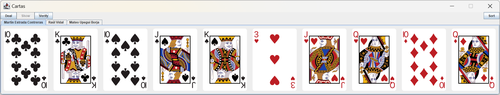

# Como compilar

La compilación de este proyectó se probó utilizando la versión del compilador de java `javac v1.8.0_412`, también 
conocida como la versión 8 de java, por lo que se recomienda utilizar esta versión o una versión superior para
compilar el proyecto.

Para compilarlo se deben ejecutar los siguientes pasos en la terminal de PowerShell desde Windows dentro de la carpeta
del proyecto, estos pasos se encargan de crear el directorio de salida, eliminar los archivos compilados previamente,
copiar los archivos de recursos al directorio de salida, compilar el proyecto y ejecutarlo:

```powershell
# Crear el directorio de salida
New-Item -Path .\out\ -ItemType Directory -Force

# Eliminar los archivos compilados previamente
Remove-Item -Path .\out\* -Recurse -Force

# Copiar los archivos de recursos al directorio de salida
Copy-Item -Path .\assets\*.png -Destination .\out\

# Compilar el projecto
javac -encoding utf8 -d .\out\ .\src\*.java

# Ejecutar el proyecto
java -cp .\out\ Main
```

Copyright (c) Mateo Upegui Borja